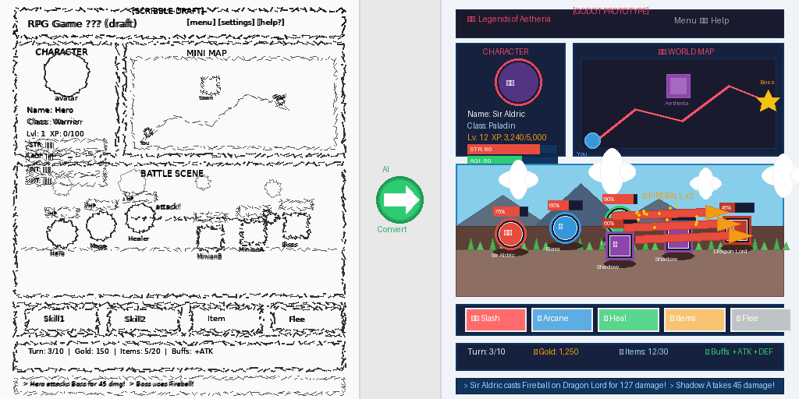

  

# image2tscn
Image-to-Godot-tscn

## 🖼️ Image to Godot TSCN Converter

A lightweight utility designed to streamline your Godot Engine workflow. This agent converts standard image files (PNG, JPG, etc.) directly into fully functional `.tscn` scene files, allowing you to skip manual node setup.

---

## ✨ Key Features

- **Instant Scene Generation**: Automatically wraps your images in a Godot scene file. No more dragging images into the editor and creating `Sprite2D` or `TextureRect` nodes manually.
- **Native Compatibility**: The output is a standard `.tscn` file. It opens natively in Godot, supports all standard editing features, and can be instanced like any other scene.
- **Batch Processing**: Designed for efficiency. Convert entire folders of assets in seconds, perfect for populating tilesets or UI libraries.
- **Smart Node Setup**: Automatically configures the root node and texture properties to match the image dimensions.

## 🎯 Use Cases

- **Rapid Prototyping**: Quickly get visual assets into your game world without breaking your coding flow.
- **Asset Migration**: Easily port graphical resources from other frameworks where images are the primary source of truth.

## Phases

- The project will be open-sourced in phases
